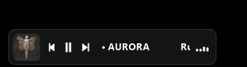
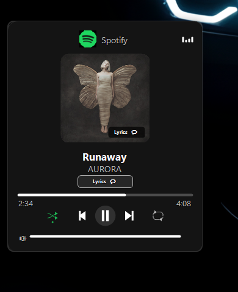
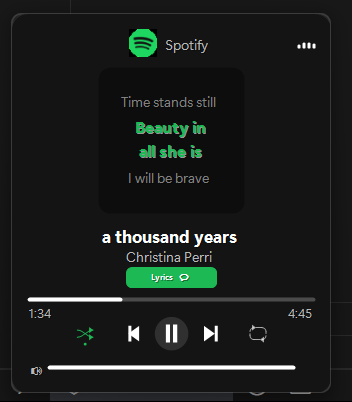

# Taskbar Music Lounge Pro (v5.0.1)

A native-style media controller mod for the Windows 11 taskbar, featuring smooth transitions, audio visualizers, real-time seek controls, and beautiful Apple Music-style lyrics integration.

---

## ✨ Features

- **Universal Playback Scanning:** Automatically detects active media from Spotify, VLC, Chrome, Edge, Firefox, Opera, and more.
- **Apple Music-Style Scrolling Lyrics:** Fluid, scroll-animated vertical transitions with a depth-of-field alpha fading effect for inactive lines.
- **Smart Lyric Word-Wrapping:** Automatically splits long lyrics into two vertically-stacked lines at standard size, preventing tiny or squashed text.
- **Real-Time Seeker:** Instant track seeking with smooth real-time progress updates across browser and desktop media.
- **Classic Win32 Icon Resolution:** Resolves and displays proper icons for desktop apps (e.g. VLC cone icon).
- **Settings Customization:** Seamless integration with Windhawk settings (enable/disable lyrics, visualizers, fonts, sizes, and layout options).
- **Instant Auto-Hide:** Automatically hides the taskbar compact ticker and Now Playing popup instantly when media stops or is closed.

---

## 📸 Screenshots

Here are some interface previews of the Taskbar Music Lounge Pro:

### 1. Compact Bar

### 2. Pop Up 

## 3. Lyrics 

---

## 🛠️ Installation

1. Install [Windhawk](https://windhawk.net/).
2. Create a new mod inside the Windhawk console.
3. Copy the source code from `Code.cpp` into your Windhawk editor.
4. Compile and enjoy!
